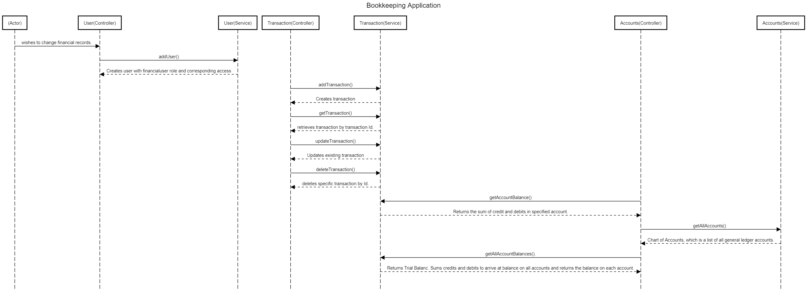

# **Bookkeeping API Project**


## Table  of Contents

* [Purpose](#purpose)
* [Project Requirements](#Requirements)
* [Technologies](#technologies)
* [Setup](#setup)


## Purpose
The application is meant to record business transactions onto a ledger, with a JSON file taking the place of the ledger. 
It is intended to allow the user to create transactions to group like transactions together and post transactions to those transactions. 
At it's highest level it allows the user to aggregate these transactions to produce the balance on these transactions, this is commonly known as a trial balance in accounting. 
Based on the nature of the transaction and whether the transaction is credit or debit, it indicates, income,asset, liability or expense. This information is used to prepare financial statements.


A more refined product would log the date,time and initiator of every transaction. It would also have more security functionalities.It would also have some safeguarding to reduce possibilities of duplicate transactions
Ideally it would restrict access to functions based on whether a user had ReadOnly, DraftOnly, FinanceUser access at the moment however there is no authentication or security.
There is no database integration.




| Package/ Location                                                            | Purpose                                                                                                        | 
|------------------------------------------------------------------------------|----------------------------------------------------------------------------------------------------------------|
| [application.properties](src/main/resources/application.properties)          | Properties file declares common properties in project                                                          | 
| [Model classes](src/main/java/com/cbfacademy/apiassessment/entities)         | Objects which the CRUD Operations are performed on.                                                            | 
| [Service classes](src/main/java/com/cbfacademy/apiassessment/services)       | Service interfaces and implementation of methods for file operations. Also contain error & exception handling. |
| [Controller classes](src/main/java/com/cbfacademy/apiassessment/controllers) | House REST Controllers which accept request from clients and pass to relevant method for processing.           | 

## Project Requirements

#### <u>**1. At least one algorithm**</u>

Throughout the programme I have used algorithms to find, categorise and return data.

An algorithm being a sequence of steps used to solve a problem. 

| Operation | Steps                                                                                                                    |
|-----------|--------------------------------------------------------------------------------------------------------------------------|
| Create    | 1. Read file <br/> 2. Add new object to file <br/> 3.Save new file                                                       |
| Read      | 1. Read file                                                                                                             |
| Update    | 1. Read file <br/> 2. Loop through information, find object, delete, add new object with changed state <br/> 3.Save file |
| Delete    | 1. Read file <br/> 2. Find object and delete <br/> 3. save amended file.                                                 |


#### <u>**2. Unit test at least one class**</u>

I tested my API endpoints by sending requests and testing its response to ensure the expected response body and status code are present. 

````
@Test
@Description("/User endpoint returns expected response for addUser")
public void ExpectedResponseWithUserAdded() {
User user = new User("1010101","Jennifer Lopez", Role.ReadOnly);
ResponseEntity<User> response = userController.addUser(user);
assertEquals(HttpStatus.OK, response.getStatusCode());
assertEquals(user, response.getBody());
}
````

#### <u>**3. Store the data in a JSON file**</u>

**Location of files:** [path](src/main/resources) 

I used the Jackson object mapper which is part of spring-boot-starter-json to write/read JSON to and from two main objects (users and transactions).
I did this by instantiating the object mapper within methods in the service classes. The outgoing and incoming requests and responses in the controller are handled by these methods. 


#### <u>**4.Evidence of inheritance**</u>

Inheritance is a process to acquire or inherit one class of attributes into another class. 

On straight forward example of inheritance is between the TransactionService interface and the Transactions ServiceImpl.

Another is in my instantiations of arrays which  inherit from the Collection interface.


#### <u>**5.Good use of HTTP Protocols - methods, request and response, have full CRUD operations supported**</u>

Using the User Controller Class for demonstrative purposes.

| Post Man Methods | CRUD                                                                                                           | Endpoint Examples |
|------------------|----------------------------------------------------------------------------------------------------------------|-------------------|
| POST             | Properties file declares common properties in project                                                          | http://localhost:8080/userController/addUser                  |
| GET              | Objects which the CRUD Operations are performed on.                                                            | http://localhost:8080/userController/getUserById                  |
| PUT              | Service interfaces and implementation of methods for file operations. Also contain error & exception handling. | http://localhost:8080/userController/updateUser                  |
| DELETE           | House REST Controllers which accept request from clients and pass to relevant method for processing.           |  http://localhost:8080/userController/deleteUserById/                 |

##### Response & Request Formats  
**Response**: JSON responses with appropriate status codes (e.g 200 OK, 500 Internal Error).  
**Request** Utilising postman requires an URL representing the API endpoint.

##### Authentication & Authorisation
Ideally each user has roles (READ ONLY and Finance User). Access to endpoints would be tailored to these roles.


####  <u>**6.Documentation**</u>

Provided in the form of this README markdown.
Also attempted to use Swagger the opensource API documentation framework.


## Technologies
1. [JDK 17](https://learn.microsoft.com/en-gb/java/openjdk/download#openjdk-17) (or higher)
2. [Git](https://git-scm.com/downloads)
3. [Visual Studio Code](https://code.visualstudio.com/Download)
   1. [Extension Pack for Java](https://marketplace.visualstudio.com/items?itemName=vscjava.vscode-java-pack)
   2. [Spring Boot Extension Pack](https://marketplace.visualstudio.com/items?itemName=vmware.vscode-boot-dev-pack)
4. [Postman or other RESTful API testing tool](https://www.postman.com/downloads/)


## Setup

### 1. Clone the Repository

```cmd
git clone [REPO_URL]
cd [REPO_NAME]
```
Replace [REPO_URL] with the link to your GitHub repository and [REPO_NAME] with the repository's name.


### 2. Install the Dependencies

Open a terminal at the root of the repo directory and run the following command to install the dependencies:

```cmd
./mvn clean dependency:resolve
```


### 3.Running the Application

```cmd
mvnw spring-boot:run
```
Open your browser and navigate to `http://localhost:8080`.


